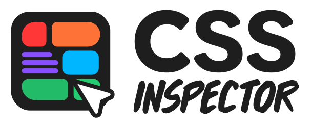

\# CSS Inspector, a Claude Code skill

**A visual CSS inspector and editor that <mark data-color="#ffd700aa" style="background-color: rgba(255, 215, 0, 0.667); color: inherit;">pops out dynamically from a skill</mark>**\
Pick any element, tweak its styles like Figma / Webflow, then hand the changes to Claude.

No DevTools, no manual diffs. You don't have to use Cursor's and VScode's toolbar that only works with their chat agent and not Claude's chat.

Built by Aviran Revach · [GitHub](https://github.com/aviranrevach)\
*Dedicated 🖤 to my team at [Atera](https://atera.com) and the product-design students.*

---

## What it does

Two things in one panel: **inspect any element visually**, then **hand the changes off to Claude cleanly**.

You're vibe coding in Claude Code inside VS Code. The chat is fast, the diffs are clean — but the moment you need to nudge a padding by 4 px, swap a button variant, or reorder a row of pills, you're back to typing prose like "make the hero title a bit bigger and the spacing tighter" and re-reading whatever Claude inferred. That's the gap this skill closes.

It's a visual editor that lives in your page, with **Webflow- and Figma-shaped controls** and a Claude hand-off built in. Pick any element, drag values around with real sliders and scrubs, swap component variants from dropdowns, drag children to reorder them — and when you're happy, paste one prompt back into Claude. The prompt carries structured JSON payloads so Claude can find each rule / component / list in your source files, edit precisely, and show you a diff before writing.

---

## Capabilities

Draggable, resizable, minimizable panel docked top-right. At a glance:

| Capability | What it does |
| --- | --- |
| **Design tab** | Visual editing of every common CSS property — Position, Layout, Appearance, Typography (full breakdown below). Live preview, scrub-on-drag, gradient + eyedropper. |
| **CSS Raw tab** | Paste / type raw CSS declarations; click *Apply to tracker* to record them all as tracked changes. |
| **Component variants** | When the manifest recognises a picked element, a `Component identified` section appears with **variant dropdowns** (e.g. `Button → variant: primary / destructive / ghost`). |
| **Convert-to** | Multi-element refactor on the design-system side (e.g. select 3 Buttons → `Convert to SegmentedControl`). |
| **Sibling reorder** | **Arrow keys** nudge a picked element among its siblings; **drag** the small pink circle handles for direct positioning. Cursor-exit promotion auto-targets the ancestor whose layout axis matches the cursor's exit direction. |
| **Multi-select picking** | Pick multiple elements at once (opt-in in Settings); variant changes and conversions apply to the whole batch. |
| **Changes drawer + undo / redo** | Bottom bar accumulates every edit. Undo / redo step through the whole history (CSS edits, variant swaps, reorders, conversions). Same-parent reorders collapse to one logical change. |
| **Copy Prompt for Claude** | One coral button copies a structured prompt (summary + `<changes>` / `<components>` / `<reorders>` JSON blocks) Claude can apply precisely. Hover any row to preview its slice. |
| **Chat-ready intro** | Smaller hand-off: copy a context line (selector + page + ancestors + children summary) for ad-hoc Claude questions that don't need the structured payload. |
| **Settings** | Toggle Edit-by-class, Show selection box, Design-system preset, Multi-select picker, "Ask Claude" fallback. |

### Design tab — visual editing breakdown

| Section | Controls |
| --- | --- |
| **Position** | X / Y / Z, Rotation, Flip |
| **Layout** | Flow (block / flex / grid / inline), W × H, Figma-style alignment pad, Gap, Padding x/y, Margins-box diagram, Clip content, Border-box |
| **Appearance** | Opacity, Border-radius, Fill (solid + gradient + eyedropper), Stroke, Shadow, Layered effects |
| **Typography** | Font family, Size, Weight, Line-height, Letter-spacing, Color |

Every value previews live. Numeric inputs **scrub on horizontal drag**. The color picker handles solid + linear-gradient with stops, an eyedropper, and hex/HSL/RGB inputs.

### Design-system aware

If your project uses **shadcn**, the inspector recognises components by their classnames and shows a `Component identified` section with **variant dropdowns** (e.g. `Button → variant: primary | destructive | ghost`) and a `Convert to…` block (e.g. `2 Buttons → ToggleGroup`).

If your project has its own custom design system, the inspector scans your `.tsx` / `.jsx` / `.vue` files on first open, builds an inferred manifest, and writes it to `.inspector/design-system.json`. You can curate from there.

Built-in preset cards for **Claude Design, shadcn, MUI, Chakra, Mantine, Tailwind, NextUI, antd** sit in the Settings panel.

### Sibling reorder

Pick a child and press **arrow keys** to nudge it among its siblings (vertical context = ↑/↓, horizontal flex-row = ←/→). Or grab the small **pink circle handle** that appears on each sibling and drag-drop to a new position. Promotion: hover outside the selected element and the inspector auto-promotes to the nearest ancestor whose layout matches the cursor's exit direction — so you can also reorder the selected element itself among its siblings, or its container among ITS siblings, all without re-picking.

### Changes drawer + Claude hand-off

A bottom Changes bar tracks every edit with undo / redo. Click **Copy Prompt for Claude** to copy a single, structured prompt to your clipboard. Hover any row in the drawer to preview the slice that row will contribute.

Same-parent reorders **collapse to one logical change** (3 nudges on the same list = 1 row = 1 entry on the wire — Claude gets the net new order as a permutation, not three intermediate moves).

### Chat-ready intro for ad-hoc questions

Click the selector pill in the header → click **Copy chat-ready intro**. Lands a context line on your clipboard like:

> `Looking at .row.header (a <div>) on Insights → Product Items · Concepts · /insights-prototype.html. Ancestors: .stage > .frame > .splitG > .list-wrap > .listG. Children: 6 (.row-mark, .title-cell, .cell-stack, .cell-stack, .status-cell, .arr-cell).`

Paste into Claude, then type your actual question. Claude has enough hooks to find the right file and the right element before you've even finished asking.

---

## Quick start — operating from the chat

The skill is designed to be triggered conversationally. Once installed, in any VS Code project:

> 💡 **Ask Claude, and a full visual editor pops into your page.** That's the whole pitch. Nothing to install in your browser, no VS Code extension, no DevTools setup, no design tool to switch into — the skill conjures the entire UI on demand and tears it down when you're done. It only exists while you need it.

### 1. Open the inspector

Say any of these to Claude:

> "open the CSS inspector" · "inspect my page" · "let me tweak styles visually" · "I want to redesign this UI"

**The inspector runs in a regular browser tab** (Chrome / Safari / Firefox — your call). It's not embedded inside VS Code. Claude detects your project type and either spins up its own localhost or piggybacks on your existing dev server:

| Project | Where the inspector runs | URL you open |
| --- | --- | --- |
| **Static HTML + CSS** | A dedicated Python 3 server Claude starts on `:8787`, serving your files **plus** an inspector wrapper page (`inspector.html`) that iframes your `index.html` and overlays the inspector panel. Independent of anything else you have running. | `http://localhost:8787/.inspector/inspector.html` |
| **Vite / React / Vue / Next** | Your **existing dev server** (`:5173`, `:3000`, etc.). Claude temporarily injects a `<script>` tag into your project's HTML, so the inspector boots inside your normal app on the next HMR refresh. No second server. | Whatever URL your dev server already uses |

Claude usually opens the right URL for you. When you're done, in live mode the injected `<script>` tag is removed automatically; in static mode the Python server is stopped.

If your project's design system isn't a known preset, Claude offers to **scan your components and generate a manifest** so the Component section lights up.

### 2. Pick + edit

Click **Select** in the header (or use the on-page picker), then click any element on the page. The blue **selection box** appears around it; FAB action buttons appear near the selection (`Reselect`, `Clear`, `Select parent`, `Select first sibling`).

- **Design tab** → visual sliders / scrubs / color pickers / variant dropdowns
- **CSS Raw tab** → paste declarations and click *Apply to tracker*
- **Arrow keys** → reorder among siblings
- **Right-click** an element → element-tree popup showing the parent chain + sibling list

Every edit shows live and is captured in the Changes drawer.

### 3. Send it back to Claude

Click the coral **Copy Prompt for Claude** button. Paste back into the same Claude chat. The prompt opens with:

> Please apply the edits I just made in the CSS Inspector to the source code. I'm working on **Insights → Product Items · Concepts · /insights-prototype.html**. \*\***CSS changes** (2):
>
> - `.hero-title`: font-size 48px → 64px
> - `.nav`: padding 0px → 16px

\*&gt; *...followed by structured* `<changes>` */* `<components>` */* `<reorders>` *JSON blocks.*

Claude reads the structured blocks, finds the right files, and shows a **unified diff** for your confirmation before writing.

### 4. Iterate

The inspector stays open. Pick another element, make more edits, copy again. The Changes drawer accumulates — undo / redo per change, individual row removal, or full-batch copy at any time.

### 5. Discuss without applying

For an ad-hoc question ("what would make this row easier to scan?"), use the **Copy chat-ready intro** button in the element-tree popup. Pastes a context line you append your question to. Claude knows what you're pointing at without any structured payload.

### 6. Done

Tell Claude *"close the inspector"* (or just stop using it). In live mode, Claude removes the injected `<script>` tag automatically.

---

## Install

```bash
git clone https://github.com/aviranrevach/css-inspector-skill ~/code/css-inspector
cd ~/code/css-inspector
./bin/install
```

`bin/install` symlinks the repo into `~/.claude/skills/css-inspector` so the skill Claude Code loads is always the repo's HEAD. To remove: `./bin/uninstall`. If your skills live elsewhere, set `CLAUDE_SKILLS_DIR` before running.

**Requirements:** Python 3 (static-mode server) · Node.js 18+ (tests) · Claude Code.

---

## How changes get applied

Once you paste the prompt back, Claude:

1. **CSS edits** — opens the source file (path + line carried in the `<changes>` block), updates the value in place. For external stylesheets it adds an override rule to your project's CSS.
2. **Component intents** — for `swap-variant` it finds the JSX/template element matching the selector + text + DOM-index hints, then either swaps the classname or the prop, depending on how the manifest is shaped. For `convert` (e.g. 3 Buttons → SegmentedControl) it pulls the target component's API and refactors.
3. **Sibling reorders** — locates the parent's JSX block (using the parent selector + ancestor-chain hint), classifies how children render (literal JSX, hardcoded array, `.map()` + sort), and either applies directly or asks you for a source decision before touching `.map()` data.

A unified diff is always shown before any file is written. For ambiguous cases (variant swap matches multiple sites, reorder over a sorted list), Claude asks before applying.

---

## Tests

```bash
npm test          # unit tests (selector, change tracker, copy prompt) — no install needed
npm install       # one-time, for the e2e suite
npm run test:e2e  # Playwright integration test
npm run test:all  # both
```

---

## File structure

```
css-inspector/
├── cssinspector.svg     # Logo
├── README.md            # This file
├── SKILL.md             # Claude workflow instructions (the brain)
├── PLAN.md              # Roadmap + Phase status
├── overlay.js           # Inspector panel UI — injected into your page
├── server.py            # Local file server for static HTML projects
├── presets/             # Design-system preset manifests
│   ├── shadcn.json
│   └── icons/           # Brand SVGs (Claude, shadcn, MUI, Tailwind)
├── bin/
│   ├── install          # Symlink into ~/.claude/skills/css-inspector
│   └── uninstall
├── tests/               # Node-native unit tests + Playwright e2e
├── playwright.config.mjs
└── package.json
```

---

## Architecture notes

`overlay.js` is iframe-aware. In static mode the inspector page wraps the user's `index.html` in an `<iframe>` and the overlay panel lives in the parent document. The overlay resolves `targetDoc` / `targetWin` from `iframe.contentDocument` after the frame's `load` event, then binds the picker listeners, `getComputedStyle` reads, and `document.styleSheets` iteration against the iframe's document — so a click inside the iframe is observed correctly by a panel that lives outside it.

All floating overlays (blue selection box, pink reorder grippers, pink armed-level indicator, FAB action buttons, drag ghost) live in the **parent doc** so they escape any `overflow:hidden` ancestor in the target document. The whole inspector + its overlays use a stack of z-indices in the upper range of `2147483647` so they always sit on top of the target's content.

History (CSS edits + component intents + reorders) is a **single unified array** with discriminated entries — undo / redo work uniformly across all kinds.

---

## Design

Cold dark neutrals (`#1c1c1c` panel, `#d4d4d4` text). **Coral** (`#DA7756`) for primary actions (Copy Prompt, Apply to tracker). **Blue** (`#3B82F6`) for selection. **Pink/magenta** (`#ff3d8b`) for reorder affordances — visually distinct from selection so the two don't blur together.

---

## License

MIT — see [LICENSE](LICENSE).

Built by Aviran Revach · [GitHub](https://github.com/aviranrevach)